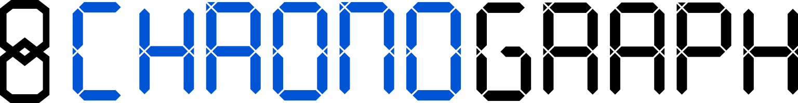

# 

ChronoGraph is a [TinkerPop](http://tinkerpop.apache.org/) Graph Database with support for content versioning.

For a conceptual overview, please see our [article in Software and Systems Modeling](https://link.springer.com/content/pdf/10.1007/s10270-019-00725-0.pdf). If you want to dig right into the code and start using ChronoGraph, read on.

# Getting Started

First of all, you need to include ChronoGraph in your JDK project. You can use your favourite dependency
management tool.

## Gradle

```gradle
dependencies {
  implementation 'com.github.martinhaeusler:org.chronos.chronograph:1.0.0'
}
```

... or, with the Gradle Kotlin DSL:

```kotlin
implementation("com.github.martinhaeusler:org.chronos.chronograph:1.0.0")
```

## Maven

```xml
<dependency>
  <groupId>com.github.martinhaeusler</groupId>
  <artifactId>org.chronos.chronograph</artifactId>
  <version>1.0.0</version>
</dependency>
```

## Building from Source

If you would rather build everything from source, simply run:

```sh
./gradlew build
```

... from the **root** directory to run a standard gradle build of all artifacts.

## Creating a new ChronoGraph instance

> Language Note: all code below is provided in Java. However, using Kotlin is fully supported and recommended.

There are several options for creating a new ChronoGraph instance. The easiest one is using the builder syntax:

```java
ChronoGraph graph = ChronoGraph.FACTORY.create()
    .exodusGraph("path/to/graph/directory")
    .build();
```

> **IMPORTANT:** ChronoGraph instances need to be closed explicitly by calling `graph.close()`!

You can optionally configure the graph with the builder like this:

```java
ChronoGraph graph = ChronoGraph.FACTORY.create()
    .exodusGraph("path/to/graph/directory")
    // call graph configuration methods here...
    .withTransactionAutoStart(false)
    // ... and "build" when you're done
    .build();
```

You can also load a graph based on a `java.util.Properties` object (or a `*.properties` file):

```java
ChronoGraph graph = ChronoGraph.FACTORY.create()
    .fromPropertiesFile("myGraphConfig.properties")
    .build();
```

This method works only if the `Properties` object (or file) contains **both** the ChronoDB configuration
as well as the ChronoGraph configuration. Configuration options can be found in `ExodusChronoDBConfiguration.java`
and `ChronoGraphConfiguration.java`, respectively.

If you wish to configure ChronoDB via the ChronoGraph builder, you can pass in a configuration lambda like so:

```java
ChronoGraph graph = ChronoGraph.FACTORY.create()
    // specify the backend and where your data is located
    .exodusGraph("path/to/graph/directory", dbConfig -> {
        // configure ChronoDB here
        return dbConfig.withDuplicateElimination(true)
                       .withLRUCacheOfSize(100_000)
    })
    // use builder methods to further configure the graph
    .withTransactionAutoStart(false)
    .build();
```

## General Usage

After creating a `ChronoGraph` instance, you can add data to it or read data from it, like so:

```java
// in-memory-graphs are great for unit testing!
ChronoGraph graph = ChronoGraph.FACTORY.create().inMemoryGraph().build();

// usually you would want to create some indices here...
ChronoGraphIndexManager indexManager = graph.getIndexManager();
indexManager.create().stringIndex().onVertexProperyt("type").build();
indexManager.create().stringIndex().onVertexProperyt("firstName").build();
indexManager.create().stringIndex().onVertexProperyt("lastName").build();
indexManager.reindexAll();

// create a transaction
try(ChronoGraph txGraph = graph.tx().createThreadedTx()){
    // you can set properties directly when adding a vertex...
    Vertex johnDoe = txGraph.addVertex(
                                T.id, "id-john", // otpional, a UUID is assigned by default
                                "type", "Person",
                                "firstName", "John",
                                "lastName", "Doe"
                            );
    // ... or you can set them afterwards, one by one
    Vertex janeDoe = txGraph.addVertex();
    janeDoe.property("type", "Person");
    janeDoe.property("firstName", "Jane");
    janeDoe.property("lastName", "Doe");

    // you can add edges like this
    johnDoe.addEdge("marriedTo", janeDoe, "since", 2020);

    // transactions have auto-rollback on close by default. If you want to keep your
    // changes, you need to call ".tx().commit()". The commit message is optional.
    txGraph.tx().commit("Added John and Jane Doe");
}

```

To query your graph, open a new transaction (threaded transactions are recommended) and run your standard
gremlin queries on it:

```java
// run a query on the current state
try(ChronoGraph txGraph = graph.tx().createThreadedTx()){
    // some example queries (standard gremlin)
    List<Vertex> justJohn = txGraph.traversal()
                                .V()
                                .has("firstName", "John")
                                .toList();

    List<Vertex> johnsWife = txGraph.traversal()
                                .V()
                                .has("firstName", "John")
                                .has("lastName", "Doe")
                                .out("marriedTo")
                                .toList();

    List<Vertex> theDoes = txGraph.traversal()
                                .V()
                                .has("lastName", CP.eqIgnoreCase("dOE"))
                                .toList();

    // if you know the ID of a vertex, you can easily retrieve it like so:
    Vertex john = txGraph.vertex("id-john");
}
```

# TinkerPop Compatibility

| TinkerPop Feature       | ChronoGraph Support | Comment                                                                                                                                                   |
| ----------------------- | ------------------- | --------------------------------------------------------------------------------------------------------------------------------------------------------- |
| Vertices                | Yes                 | Full read-write-create-delete support                                                                                                                     |
| Edges                   | Yes                 | Full read-write-create-delete support                                                                                                                     |
| User-Defined IDs        | Yes                 | Only strings are allowed. By default, UUIDs are used.                                                                                                     |
| Properties              | Yes                 | Custom types are supported (via [Kryo](https://github.com/EsotericSoftware/kryo)), but sticking to Java primitives (and `String`s) is highly recommended. |
| Multi-Valued Properties | Custom              | ChronoGraph implements multi-valued properties slightly differently than the TinkerPop standard. See the dedicated section below.                         |
| Meta-Properties         | Yes                 | No secondary indexing support.                                                                                                                            |
| Secondary Indexing      | Yes                 | For `String`, `Long`, `Double`, and `Array`s as well as `List`s and `Set`s of those types.                                                                |
| Gremlin Query Language  | Yes                 | Automatically uses secondary indices, where applicable.                                                                                                   |
| Transaction Support     | Yes                 | Full [ACID](https://en.wikipedia.org/wiki/ACID) support                                                                                                   |
| Threaded Transactions   | Yes                 | Full [ACID](https://en.wikipedia.org/wiki/ACID) support                                                                                                   |
| Graph Computer (OLAP)   | No                  | OLAP has a lot more value in distributed graph databases, which ChronoGraph is not. Use regular gremlin for your analytics instead.                       |
| Persistence             | Yes                 | Persistence is versioned, allowing for historical queries.                                                                                                |
| Concurrent Access       | Yes                 | Only one commit per millisecond, parallel commits are deferred. Full support for parallel read/write.                                                     |
| Graph I/O Read          | Yes                 |                                                                                                                                                           |
| Graph I/O Write         | Yes                 |                                                                                                                                                           |
| Graph Variables         | Yes                 | Multiple variable keyspaces are supported for easier grouping and organization of variables.                                                              |
| Distribution            | No                  | ChronoGraph is currently running only on a single server and scales vertically.                                                                           |

# Secondary Indices

ChronoGraph supports secondary indexing for Vertex and Edge properties. The supported types are:

- `String`
- `double` (and, by extension, also `float`)
- `long` (and, by extension, also `byte`, `short`, `int`)
- `List`s of `String`, `double` and `long`
- `Set`s of `String`, `double` and `long`
- `Array`s of `String`, `double` and `long`

All management operations concerning secondary indices are accessible from the `ChronoGraphIndexManager`:

```java
ChronoGraphIndexManager indexManager = graph.getIndexManager()

// create a new index using the builder syntax (don't forget "build()" at the end!)
indexManager.create().stringIndex().onVertexProperty("name").build();
// after manipulating indices, don't forget to call "reindexAll()" to rebuild the indices!
indexManager.reindexAll();

// list all vertex indicies
Set<ChronoGraphIndex> vertexIndices = indexManager.getIndexedVertexProperties();

// check if a certain property is indexed
boolean isNameIndexed = indexManager.isVertexPropertyIndexed("name");

// get a certain index
ChronoGraphIndex nameIndex = indexManager.getVertexIndex("name");

// drop an index
indexManager.dropIndex(nameIndex);
```

Queries will make use of secondary indices automatically when possible. To ensure index usage:

- Make sure you actually _have_ a secondary index on your property (watch out for typos in the property name).
- Make sure your secondary indices are clean (`indexManager.reindexAll()`).
- Make sure your gremlin starts with a `.has(...)` step on one or more indexed properties.

> **WARNING:** Manipulations on secondary indices are **management operations**. This means that:
>
> - Index management operations are **not transactional** in any way.
> - Removing an index which somebody else is currently querying may cause the query to fail unexpectedly.
> - Concurrent modifications on secondary indices are not permitted.
> - Take care not to terminate the program while a management operation is running.
>
> We **strongly recommend** to perform secondary index manipulations **once** at the startup of your application,
> before the first user request is accepted. Afterwards, we strongly discourage index management operations.

# Historical Queries

The easiest way to query "the past" in ChronoGraph is by opening a transaction **on the point in time in the past**.
This works in exactly the same way as in standard TinkerPop, except that you pass in the desired timestamp as an
additional argument:

```java
long yesterday = System.currentTimeMills() - TimeUnit.DAYS.toMillis(1);
try(ChronoGraph txGraph = graph.tx().createThreadedTx(yesterday)){ // note the "yesterday" argument!
    // txGraph will contain the database state as it was yesterday
    Vertex johnDoe = txGraph.traversal().V().has("name", "John Doe").next();
    // johnDoe will also have the same state as it did yesterday
}
```

If you are not interested in any particular **point** in time but would rather iterate e.g. over the
**history** of an element, you can use:

```java
Vertex v = ...;
// iterator will contain the timestamps at which the Vertex has changed
Iterator<Long> iterator = graph.getVertexHistory(v);
// now we can iterate over them and check the vertex at each point in time
iterator.forEachRemaining(timestamp -> {
    try(ChronoGraph txGraph = graph.tx().createThreadedTx(timestamp)){
        Vertex pastVertex = txGraph.vertex(v.id());
    }
});
```

As such tasks are very common when working with ChronoGraph, there is also the `GraphIterators` utility:

```java
graph.createIterator()
     .onMasterBranch()
     .overHistoryOfVertex("my-vertex-id")
     .visitCoordinates(state -> {
         ChronoGraph txGraph = state.getTransactionGraph();
         // inspect contents of txGraph
})
```

# Branch Management

Aside from history management, ChronoGraph also offers **branches** (as known from version control tools such
as Git or SVN).

- A branch is an alternative scenario ("child branch"), created from a particular point in time ("branching timestamp") on a particular branch ("parent branch")
- Every change which occurs after the branching timestamp on the parent branch will not be visible on the child.
- Any change on the child will not be visible on the parent.
- Branchs support arbitrarily deep nesting, but expect a performance impact when nesting them too deeply.
- There is one special branch, which is `master`. This branch always exists and has no parent.
- Branch names must be globally unique among all branches.

Any ChronoGraph transaction can be directed towards a particular branch by passing the branch name into the
transaction construction method, like so:

```java
try(ChronoGraph txGraph = graph.tx().createThreadedTx("my-branch")){
    // txGraph now points to branch "my-branch". This will only work if "my-branch" exists.
}
```

To create and manage branches, please use the `ChronoGraphBranchManager`:

```java
ChronoGraphBranchManager branchManager = graph.getBranchManager();

// create a branch "my-new-branch" as child of "master" at "branchingTimestamp"
long branchingTimestamp = ...;
GraphBranch myNewBranch = branchManager.createBranch("master", "my-new-branch", branchingTimestamp);
// - if no branching timestamp is given, the current state of the parent will be used implicitly.
// - if no parent branch is given, "master" will be used implicitly.
```

Creating new branches is **safe** to do during regular database operation.

While it is generally not recommended to do so, branches can also be _deleted_ again. This operation is
**permanent** and cannot be recovered e.g. by history queries. The data **will be gone** on disk. This can be
achieved with:

```java
ChronoGraphBranchManager branchManager = graph.getBranchManager();
// delete a branch and ALL of its direct and indirect child branches
branchManager.deleteBranchRecursively("my-branch");
```

> **WARNING:** This is a **management opertion**.
>
> - `deleteBranchRecursively` is **not** safe for concurrent access.
> - Deleting branches which still have open transactions on them will cause the transactions to **fail** randomly.
> - If the JVM process terminates while the operation is ongoing, some child branches may have been deleted
>   while others may still exist.
> - The results of this operation are always **permanent** and **cannot be undone**.

# Multi-Valued Property Handling

In this section, we discuss how ChronoGraph handles multi-valued properties, and how it is different from the
TinkerPop standard.

## Multi-Valued Properties in Gremlin

In standard Gremlin, you need to define multi-valued properties one-by-one, like so:

```java
Vertex v = ...
v.property(Cardinality.list, "colours", "red");
v.property(Cardinality.list, "colours", "green");
v.property(Cardinality.list, "colours", "blue");
```

... and then query them in Gremlin like so (this will match if **any** of the colours on a vertex is `red`):

```java
g.traversal().V().has("colours", "red").toList()
```

Note that gremlin **treats** the values like a `List`, even though they **are not** a `List`. Also,
the syntax for adding new values is rather cumbersome.

Instead of following the Gremlin standard here, we opted for a different approach.

## Multi-Valued Properties in ChronoGraph

ChronoGraph will treat `Array`s, `List`s and `Set`s in a special way. This makes it much easier
to define multi-valued properties (with a little help from [Guava](https://github.com/google/guava)):

```java
Vertex v = ...
v.property("colours", Lists.newArrayList("red", "green", "blue"))
```

> **Important:** It is bad practice to pass immutable or unmodifiable collections as property values,
> as you may run into issues when loading them back from the hard drive (deserialization).
> If you pass in instances of `List` or `Set`, make sure they are actually `java.util.ArrayList` or
> `java.util.HashSet`, respectively.

The query is exactly the same as in standard Gremlin:

```java
g.traversal().V().has("colours", "red").toList()
```

This query **will match** the property containing the list `red, green, blue`. ChronoGraph employs
"any of" semantics on **all** of its predicates.

# Search Predicates

ChronoGraph supports all of the predicates defined by Gremlin. In the table below:

- `P` refers to the class `org.apache.tinkerpop.gremlin.process.traversal.P`. `P` is the shorthand
  for "Predicate". This class contains all standard gremlin predicates.
- `TextP` refers to the class `org.apache.tinkerpop.gremlin.process.traversal`. It contains the
  text matching predicates.
- `CP` refers to the class `org.chronos.chronograph.api.builder.query`. `CP` is the shorthand
  for "Chronos Predicate". This class contains all standard gremlin predicates, and in addition all
  other predicates which are supported by ChronoGraph.

> **Tip:** In ChronoGraph, whenever you would write `P.xy` or `TextP.xy`, simply use `CP.xy` instead. You'll get
> all default Gremlin predicates, as well as the custom predicates implemented by ChronoGraph.

> **Tip:** Even though using `CP` is preferred, all regular `P` predicates will work as intended.

> **Tip:** If you need a very special matching, you can always use `.filter(lambda)` in your Gremlin. However, this
> method should not be your go-to solution, because it will be much slower than the standard predicates due to the
> lack of indexing support. Use it as a last resort.

| ChronoGraph Predicate          | Gremlin Equivalent      | Case Sensitive? | Comment                                                        |
| ------------------------------ | ----------------------- | --------------- | -------------------------------------------------------------- |
| `CP.eq`                        | `P.eq`                  | Yes             | Equality (with respect to `.equals(Object)`)                   |
| `CP.neq`                       | `P.neq`                 | Yes             | Inequality                                                     |
| `CP.gt`                        | `P.gt`                  |                 | Greater Than                                                   |
| `CP.geq`                       | `P.geq`                 |                 | Greater Than or Equal To                                       |
| `CP.lt`                        | `P.lt`                  |                 | Less Than                                                      |
| `CP.leq`                       | `P.leq`                 |                 | Less Than or Equal To                                          |
| `CP.within`                    | `P.within`              | Yes             | Checks if the value is in the given list                       |
| `CP.without`                   | `P.without`             | Yes             | Checks if the value is not in the given list                   |
| `CP.inside`                    | `P.inside`              |                 | Checks if the value is in the given range (exclusive)          |
| `CP.outside`                   | `P.outside`             |                 | Checks if the vlaue is not inside the given range (exclusive)  |
| `CP.between`                   | `P.between`             |                 | Checks if the value is in the given range (inclusive)          |
| `CP.startsWith`                | `TextP.startingWith`    | Yes             | Checks if the string starts with the given one                 |
| `CP.notStartsWith`             | `TextP.notStartingWith` | Yes             | Checks if the string does not start with the given one         |
| `CP.endsWith`                  | `TextP.endingWith`      | Yes             | Checks if the string ends with the given one                   |
| `CP.notEndsWith`               | `TextP.notEndingWith`   | Yes             | Checks if the string does not end with the given one           |
| `CP.contains`                  | `TextP.containing`      | Yes             | Checks if the string contains the given one                    |
| `CP.notContains`               | `TextP.notContaining`   | Yes             | Checks if the string does not contain the given one            |
| `CP.eqIgnoreCase`              | -                       | No              | Case-insensitive string equality                               |
| `CP.neqIgnoreCase`             | -                       | No              | Case-insensitive string inequality                             |
| `CP.startsWithIgnoreCase`      | -                       | No              | Case-insensitive prefix check                                  |
| `CP.notStartsWithIngoreCase`   | -                       | No              | Case-insensitive negated prefix check                          |
| `CP.endsWithIgnoreCase`        | -                       | No              | Case-insensitive suffix check                                  |
| `CP.notEndsWithIgnoreCase`     | -                       | No              | Case-insensitive negated suffix check                          |
| `CP.containsIgnoreCase`        | -                       | No              | Case-insensitive string containment check                      |
| `CP.notContainsIgnoreCase`     | -                       | No              | Case-insensitive negated string containment check              |
| `CP.withinIgnoreCase`          | -                       | No              | Case-insensitive list containment check                        |
| `CP.withoutIgnoreCase`         | -                       | No              | Case-insensitive negated list containment check                |
| `CP.eq(double, double)`        | -                       |                 | Numeric equality check with equality tolerance                 |
| `CP.neq(double, double)`       | -                       |                 | Numeric inequality check with equality tolerance               |
| `CP.within(list, double)`      | -                       |                 | Numeric list containment check with equality tolerance         |
| `CP.without(list, double)`     | -                       |                 | Negated numeric list containment check with equality tolerance |
| `CP.matchesRegex`              | -                       | Yes             | Regular expression matching                                    |
| `CP.matchesRegexIgnoreCase`    | -                       | No              | Case-insensitive regular expression matching                   |
| `CP.notMatchesRegex`           | -                       | Yes             | Negated regular expression matching                            |
| `CP.notMatchesRegexIgnoreCase` | -                       | No              | Negated case-insensitive regular expression matching           |

# Known Limitations

- Since a commit is uniquely identified by its timestamp and Java timestamps are measured in milliseconds,
  only one commit is possible per millisecond. If multiple commits attempt to commit during the same millisecond,
  all except for one will be delayed by 1ms to make sure that there is no more than one commmit per millisecond.

- ChronoGraph has been tested extensively and is known to work well with graphs in the following magnitude:

  - Vertices: 0 ~ 500.000
  - Edges: 0 ~ 1.000.000
  - Concurrent users: 0 ~ 200
  - Properties (per element): 0 ~ 50
  - Adjacent Edges per Vertex: 0 ~ 1000
  - Versions: 0 ~ 200.000

  If your configuration substantially exceeds those known territories, you may encounter various issues. If that
  is the case, please file a bug.

- Some backends may have hard limits on how big an individual entry can be. For example, the standard Exodus
  backend has a limit of 8MB per entry. This means that the vertex record in its entirety must be less than
  8MB. Properties, meta-properties and adjacent edges all contribute to the size of a vertex record. In our
  tests, we've found that a vertex can at most have about ~ 100.000 adjacent edges before hitting the size
  limit of an Exodus entry. This is of course also influenced by the length of your IDs and the other
  aforementioned pieces of information that count towards the vertex record size. By the same argument, you
  cannot store a text blob of 1GB in a ChronoGraph vertex.

- ChronoGraph is **not suited** for time-series data which changes very rapidly. For example, if you have
  a monitoring tool which reports the CPU usage of your server once every 10ms, storing this data in
  ChronoGraph is not a good idea as we currently have no way of compacting such data to make this use case feasible.
  While ChronoGraph does provide reliable versioning, it is best-suited for data which is edited manually
  and primarily needs to be queried.

- Be aware that, due to the versioned nature of ChronoGraph, your on-disk footprint of the database will always
  be substantially larger than a single revision of your data, as all history is retained, persisted and managed.
