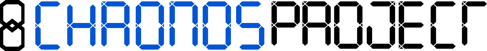
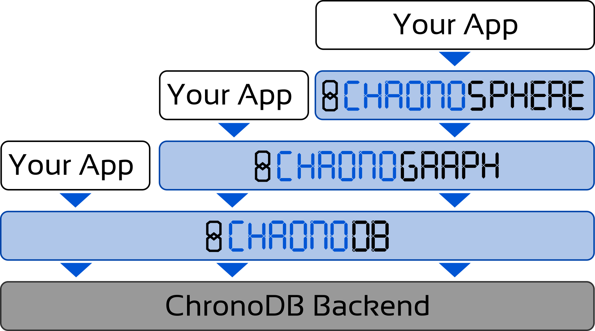

# 

Welcome to the Chronos Project. This project is dedicated to providing **efficient** and **easy-to-use** versioned database persistence solutions for the Java Virtual Machine. It is written in Java and Kotlin, and some parts also make use of Groovy. There are three main components to Chronos:

- **[ChronoDB](org.chronos.chronodb.api/readme.md)**: Versioned Key-Value Store
- **[ChronoGraph](org.chronos.chronograph/readme.md)**: Versioned [TinkerPop](http://tinkerpop.apache.org/) Graph Database
- **[ChronoSphere](org.chronos.chronosphere/readme.md)**: Versioned [EMF](https://www.eclipse.org/modeling/emf/) Model Repository

These components build on top of each other, but each component can also be used individually:

# Getting Started

To get started using Chronos, please pick one of the core components and follow the instructions in the respective readme files. As a general recommendation:

- **ChronoDB** is a low-level abstraction. It is a versioned key-value store which additionally offers secondary indexing and other utilities. Of all the components, it offers the highest amount of control. However, you will be responsible for your own data layout and data integrity. You should only use ChronoDB directly if you know exactly what you are doing. **Most users will not need to use ChronoDB directly.**

- **ChronoGraph** is built on top of ChronoDB and is **recommended for most users**. It offers a medium-level abstraction and implements the [Apache TinkerPop](http://tinkerpop.apache.org/) standard for graph databases. It also fully supports the Gremlin query language. The graph integrity will be handled by ChronoGraph internally.

- **ChronoSphere** is a high-level abstraction. It builds on top of ChronoGraph and supports the [Eclipse Modeling Framework](https://www.eclipse.org/modeling/emf/) standard. Only recommended for users with model-driven requirements.

# Licensing & Contributing

The Chronos Project is based on a dual-license:

- **aGPLv3** for academic and open-source projects
- **Commercial licenses** are also available **on demand**

BY CONTRIBUTING TO CHRONOS, YOU AGREE THAT YOUR CONTRIBUTIONS WILL BE LICENSED UNDER THE aGPL v3 LICENSE. Furthermore, by contributing to the Chronos Project, you hereby grant to Martin Häusler and any recipients of your contributions, including but not limited to users of this site, a perpetual, worldwide, non-exclusive, no-charge, royalty-free, irrevocable license to reproduce, prepare derivative works of, publicly display, publicly perform, sublicense, use, make and distribute your contributions and any derivative works under all intellectual property rights including but not limited to copyright and patent. BY CONTRIBUTING TO THE CHRONOS PROJECT, YOU REPRESENT AND WARRANT THAT YOU ARE LEGALLY ENTITLED TO GRANT THE FOREGOING LICENSE.
